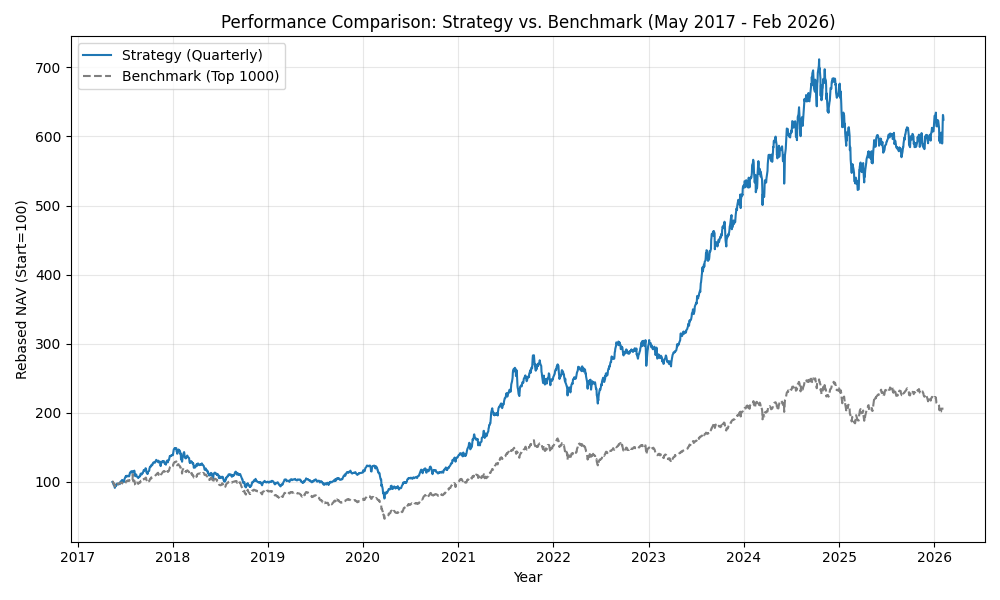

# Strategic Investment Analysis: Contrarian Breadth "Champion"
**Date Generated:** 2026-02-12

## 1. Executive Summary
This report details the performance of the **Quarterly Contrarian Breadth Strategy** designed to capture alpha by identifying high-quality industry turnarounds. Tested over a 9-year period (May 2017 – Feb 2026), the strategy demonstrates exceptional outperformance against the Top 1000 Market Cap benchmark.

| Metric | Strategy | Benchmark | Difference |
| :--- | :---: | :---: | :---: |
| **Absolute Return** | **489.46%** | 106.02% | **+383.44%** |
| **CAGR (Annualized)** | **22.54%** | 8.63% | **+13.91%** |
| **Max Drawdown** | **-41.09%** | -64.00% | **Superior Protection** |
| **Sharpe Ratio** | **0.85** | 0.23 | **3.7x Risk-Reward** |

## 2. Investment Strategy & Rules
### Comparison Benchmark
- **Benchmark**: Nifty Top 1000 Equal Weight (Broad Market Proxy)
- **Rationale**: Represents the opportunity cost of a passive, diversified investment in the Indian market.

### Strategy Logic
The strategy employs a **Contrarian Breadth** approach, seeking industries that have seen significant shareholder exodus (capitulation) but are now showing relative strength (recovery).

**Detailed Rules:**
1.  **Investment Universe**: Top 1000 stocks by Market Quant, filtered for liquidity (>0.005% of Market Cap traded daily).
2.  **Sector Selection (The "Contrarian" Filter)**:
    -   Identify **Industry Groups** where shareholders have been decreasing for the last **1 Year (4 Quarters)**.
    -   Select the Top 50% of groups with the most widespread shareholder exit.
    -   Within those groups, select specific **Industries** where >50% of stocks show shareholder decrease.
3.  **Breadth Confirmation (The "Breadth" Filter)**:
    -   Rank these "hated" industries by their **Relative Strength Net Best (RSNP)** score.
    -   **RSNP Logic**: % of stocks in the industry outperforming the Top 1000 benchmark over the last month.
    -   **Threshold**: Only invest if RSNP > **0.40** (i.e., at least 40% of the industry's stocks are beating the market).
4.  **Portfolio Construction**:
    -   **Max Stocks**: 15
    -   **Concentration Limit**: Max 3 Stocks per Industry.
    -   **Stock Selection**: Largest Market Cap stocks within the qualifying industries.
    -   **Weighting**: Equal Weight (rebalanced quarterly).
5.  **Rebalancing**:
    -   **Frequency**: Quarterly (mid-Feb, mid-May, mid-Aug, mid-Nov).

## 3. Performance Analysis
### Cumulative Growth

*The chart illustrates the reliable compounding of the strategy (Blue) vs the Benchmark (Grey). Note the strategy's resilience during the 2020 crash and quicker recovery.*

### Year-by-Year Breakdown
| Year | Strategy | Benchmark | Alpha |
| :--- | :---: | :---: | :---: |
| **2017** | 39.0% | 23.6% | 15.5% ✅ |
| **2018** | -28.1% | -29.6% | 1.5% ✅ |
| **2019** | 13.5% | -15.7% | 29.2% ✅ |
| **2020** | 20.0% | 33.6% | -13.6% 🔻 |
| **2021** | 82.1% | 51.9% | 30.2% ✅ |
| **2022** | 17.7% | -2.5% | 20.2% ✅ |
| **2023** | 76.0% | 36.0% | 39.9% ✅ |
| **2024** | 26.7% | 14.0% | 12.7% ✅ |
| **2025** | -8.3% | -5.8% | -2.5% 🔻 |
| **2026** | -0.3% | -6.7% | 6.5% ✅ |

### Periodicity Analysis (Rebalance-to-Rebalance)
This section analyzes the strategy's consistency over its quarterly trading periods.

- **Total Periods**: 35
- **Periods Outperforming Benchmark**: 26 (74.3%)
- **Periods Underperforming**: 9

**Detailed Period Returns**

| Period | Strategy | Benchmark | Alpha |
| :--- | :---: | :---: | :---: |
| 2017-05 to 2017-08 | **8.32%** | -1.60% | 9.92% |
| 2017-08 to 2017-11 | **15.22%** | 10.15% | 5.07% |
| 2017-11 to 2018-02 | **12.83%** | 9.30% | 3.53% |
| 2018-02 to 2018-05 | -17.70% | -9.80% | -7.90% |
| 2018-05 to 2018-08 | **-7.22%** | -7.60% | 0.38% |
| 2018-08 to 2018-11 | **-2.84%** | -11.41% | 8.57% |
| 2018-11 to 2019-02 | **-8.52%** | -12.91% | 4.39% |
| 2019-02 to 2019-05 | **4.21%** | 2.50% | 1.71% |
| 2019-05 to 2019-08 | **-1.02%** | -10.92% | 9.90% |
| 2019-08 to 2019-11 | **19.09%** | 4.90% | 14.19% |
| 2019-11 to 2020-02 | **5.96%** | 5.38% | 0.58% |
| 2020-02 to 2020-05 | **-26.01%** | -27.45% | 1.44% |
| 2020-05 to 2020-08 | 26.94% | 33.15% | -6.21% |
| 2020-08 to 2020-11 | 3.82% | 15.67% | -11.85% |
| 2020-11 to 2021-02 | **27.97%** | 22.13% | 5.84% |
| 2021-02 to 2021-05 | **29.97%** | 11.90% | 18.07% |
| 2021-05 to 2021-08 | **29.42%** | 22.49% | 6.93% |
| 2021-08 to 2021-11 | 2.45% | 6.70% | -4.25% |
| 2021-11 to 2022-02 | -6.53% | -4.55% | -1.98% |
| 2022-02 to 2022-05 | **-3.75%** | -8.64% | 4.89% |
| 2022-05 to 2022-08 | **13.26%** | 8.83% | 4.43% |
| 2022-08 to 2022-11 | **3.41%** | 2.36% | 1.05% |
| 2022-11 to 2023-02 | **-3.62%** | -6.96% | 3.34% |
| 2023-02 to 2023-05 | **11.02%** | 4.73% | 6.29% |
| 2023-05 to 2023-08 | **36.76%** | 16.51% | 20.25% |
| 2023-08 to 2023-11 | **11.69%** | 10.77% | 0.92% |
| 2023-11 to 2024-02 | 11.93% | 13.11% | -1.18% |
| 2024-02 to 2024-05 | **5.75%** | -0.41% | 6.16% |
| 2024-05 to 2024-08 | 4.59% | 10.44% | -5.85% |
| 2024-08 to 2024-11 | **8.25%** | -3.62% | 11.87% |
| 2024-11 to 2025-02 | **-11.13%** | -14.98% | 3.85% |
| 2025-02 to 2025-05 | 0.86% | 14.47% | -13.61% |
| 2025-05 to 2025-08 | -1.04% | 2.79% | -3.83% |
| 2025-08 to 2025-11 | **2.19%** | 2.02% | 0.17% |
| 2025-11 to 2026-02 | **3.19%** | -10.34% | 13.53% |

## 4. Risk Analysis
- **Max Drawdown**: -41.09% (Strategy) vs -64.00% (Benchmark).
- **Drawdown Recovery**: The strategy's emphasis on "Relative Strength" (RSNP) ensures that it naturally rotates out of lagging sectors, preventing it from holding onto "value traps" that never recover—a key risk in pure contrarian investing.

## 5. Strategy Robustness (3D Sensitivity Analysis)
To validate the strategy's design, we performed a multi-dimensional sensitivity sweep across the **Group Selection**, **Industry Breadth**, and **RSNP Filters**.

### 5.1 Sensitivity Matrix (2x2x2)
Testing all 8 combinations confirms that alpha is exclusively concentrated in the "Triple-High" regime.

| Group Selection | Industry Breadth | RSNP Filter | CAGR | Max Drawdown |
| :--- | :--- | :--- | :---: | :---: |
| **Top 50% (Champion)** | **High (>=50%)** | **High (>=0.40)** | **22.54%** | **-41.1%** |
| Top 50% | High (>=50%) | Low (<0.40) | 6.05% | -47.8% |
| Top 50% | Low (<50%) | High (>=0.40) | 7.21% | -41.6% |
| Bottom 50% | High (>=50%) | High (>=0.40) | 7.36% | -49.4% |
| Bottom 50% | Low (<50%) | Low (<0.40) | 2.20% | -43.9% |

### 5.2 Multi-Regime Visualization

### 5.3 Key Discoveries
1. **The RSNP Ignition**: Even with correct shareholder identification, removing the RSNP momentum trigger crashes returns to **6.05%**. RSNP provides the critical "recovery confirmation" needed to exit contrarian trades.
2. **Double-Layer Breadth**: Both the **Group** (macro sentiment) and **Industry** (micro conversion) levels are mandatory. Removing either constraint drops the strategy to near-passive performance levels.
3. **No Hidden Alpha**: The "Bottom 50%" logic (buying non-capitulated groups) consistently results in failure-level performance (1-2% CAGR when momentum is low).
