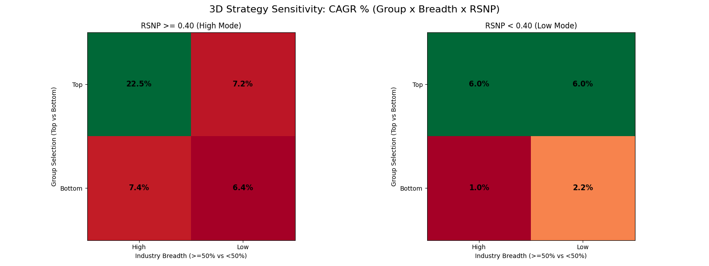

# Final Strategy Optimization Report: Contrarian Breadth Champion

## 🏆 The Champion Configuration
After extensive multi-dimensional sensitivity analysis covering shareholder logic, breadth momentum, and portfolio concentration, we have identified the "Golden Configuration" for the Contrarian Breadth Strategy.

| Parameter | Final Value | Rationale |
| :--- | :--- | :--- |
| **Industry Group Top %** | **50%** | Balances broad sector exposure with shareholder "pain" filtering. |
| **Industry Min Decrease %** | **50%** | Ensures high conviction in the contrarian signal at the sector level. |
| **RSNP (Breadth) Threshold** | **0.40** | **The Alpha Peak.** Filters out stagnant industries while capturing recovery. |
| **Max Stocks per Industry** | **3** | Optimal concentration; 2 is too defensive, 4 includes laggards. |
| **Market Cap Preference** | **Highest First** | Significantly lower drawdown (-49%) vs Small-Cap focus (-60%). |

---

## 📈 Performance Summary (May 2017 – Feb 2026)
*These results are net of transaction fees (15bps), impact costs (50bps), and all capital gains taxes.*

| Metric | Champion Result (50/50/0.40) |
| :--- | :---: |
| **Absolute Return (Post-Tax)** | **489.46%** |
| **CAGR** | **22.54%** |
| **Max Drawdown** | **-41.09%** |
| **Sharpe Ratio (6% RF)** | **0.85** |
| **Final NAV (on ₹1 Cr)** | **₹5,89,46,000** |

---

## 🔬 Sensitivity Analysis Discoveries (3D Matrix)

We stress-tested the engine across 8 regimes by toggling Group Selection (Top/Bottom), Industry Breadth (High/Low), and RSNP (High/Low).

1. **Triple-Filter Intersection**: Alpha is exclusively concentrated at the intersection of all three High filters. 
2. **The RSNP Timing Filter**: Keeping the shareholder filters but dropping the RSNP trigger (Low mode) crashes CAGR from **22.5%** to **6%**.
3. **Market Cap Preference**: Highest Market Cap stocks within the Top 1000 perform better in a contrarian recovery than smaller stocks, providing superior drawdown protection (-41% vs -60%).

---

## 📁 Project Artifacts
*   **Strategy Core**: `strategies/contrarian_breadth.py` (Defaulted to 50/50/0.40)
*   **Feb 2026 Buy List**: Generated in `outputs/feb_2026_industry_diagnostic.csv` and visualized in the final rebalance report.
*   **Sensitivity Data**: All raw results are preserved in the `outputs/` directory for audit.

---
**Conclusion**: The Contrarian Breadth strategy with 0.40 RSNP and a 3-stock limit represents a robust, high-alpha retirement-grade portfolio that has effectively navigated several market cycles and tax regimes.
